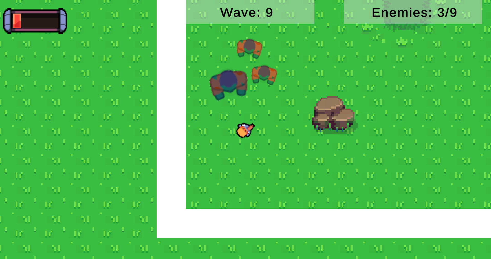
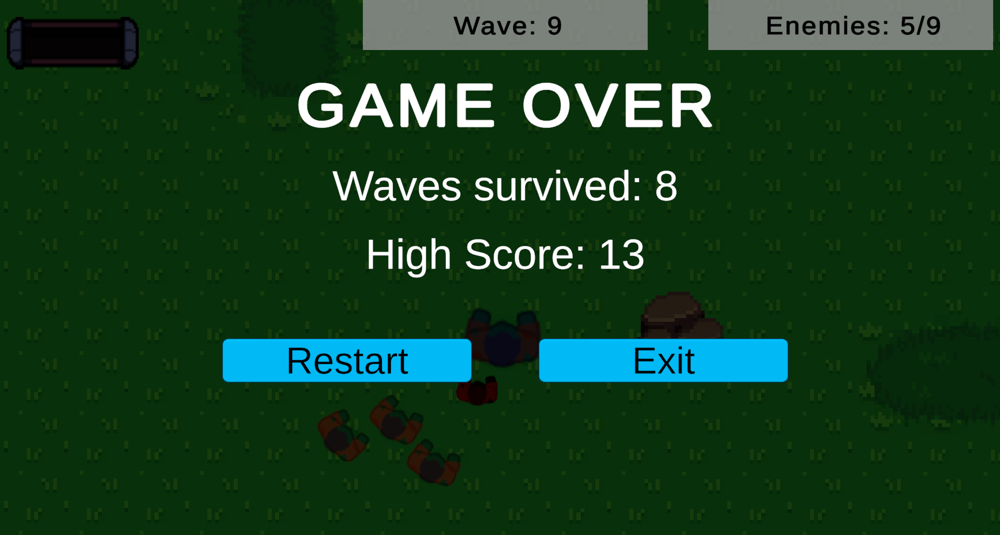

# Arena Survival

*Wave-based combat with visual feedback*

*High score tracking with wave progression*

A wave-based top-down shooter where you have to survive as long as possible against three enemy types with escalating difficulty.

## 🎮 Controls

- **WASD** - Move
- **Mouse** - Aim  
- **Left Click** - Shoot

## 🎯 Gameplay

Fight endless waves of enemies. Each wave spawns more and tougher enemies.

### Enemy Types
- **Chaser** - Standard enemy, 2 HP, 1 damage, medium speed
- **Fast** - Quick and agile, 1 HP, 1 damage, high speed
- **Tank** - Slow but dangerous, 5 HP, 2 damage, low speed

### Player Mechanics
- 5 HP starting health
- Invincibility frames after taking damage (visual flash)
- Knockback on hit with screen shake feedback
- High score persists between sessions

### Wave Progression
- Waves 1-3: Chasers only
- Waves 4-7: Chasers + Fast enemies
- Wave 8+: All three enemy types with increasing spawn counts

## 🛠️ Technical Details

**Engine:** Unity 2D  
**Language:** C#  
**Development Time:** 10 days (December 1-11, 2025)

### Features Implemented
- New Input System for player controls
- Cinemachine camera (follow + screen shake on damage)
- Wave-based difficulty scaling
- Enemy AI with inheritance-based design (base Enemy class → 3 children)
- Particle effects on enemy death
- Coroutines for timing effects (fade in/out, invincibility)
- PlayerPrefs for high score persistence
- Smart spawn system (collision check + distance from player)

### Code Architecture
- 15 C# scripts with separation of concerns
- Object-oriented design (inheritance for enemy types)
- Event-driven communication (Enemy → SpawnManager)
- Singleton pattern (AudioManager)
- SerializeField for Inspector tweaking

## 📦 Assets

- **Sprites:** Kenney.nl / Opengameart.com CC0
- **Audio:** Placeholder/free sound effects CC0
- **Particles:** Unity Particle System

## 🎓 Learning Objectives

This is my first complete game project. Focus areas:
- Complete game development cycle (concept → implementation → polish → build)
- Unity 2D workflow and tools
- C# OOP principles (inheritance, polymorphism, encapsulation)
- Game feel (visual feedback, screen shake, knockback)
- Wave-based difficulty balancing
- Version control with Git/GitHub

## 📝 Known Issues

- Sprites are placeholders (zombie theme doesn't perfectly match gameplay aesthetic)
- No sprite animations (static sprites only)
- Custom cursor remains visible on all screens (intentional simplification)

## 🚀 Potential Future Improvements

- Multiple weapon types with different projectiles
- Power-up system (health, speed, fire rate)
- Boss waves every 5-10 waves
- Sprite animations (walk, attack, death)
- Enhanced visual effects and particle systems
- Background music and polished sound design

## 📄 Project Info

**Purpose:** Educational/Portfolio  
**Developer:** Carmine Billi
**Date:** December 2025  
**GitHub:** (https://github.com/carmineb-dev/ArenaShooterSurvival)

---

*This project was created as part of my game development learning journey, focusing on fundamental Unity/C# skills and completing a full game development cycle.*

